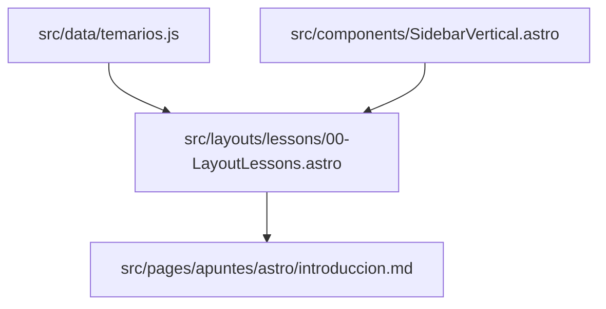

# Organización de archivos en Tyac

Un proyecto grande como Tyac requiere una estructura profesional para no volverse un caos. Astro nos permite organizar los archivos de una manera lógica que separa los datos del diseño.

## La anatomía de `src/` en Tyac

En este proyecto, hemos seguido un esquema de **Diseño Atómico** adaptado a Astro:

### 1. `src/data/` (El cerebro)
Aquí es donde viven archivos como `temarios.js` y `cursos.js`. En lugar de escribir el temario a mano en cada página, lo centralizamos aquí para que la UI se genere automáticamente.

### 2. `src/components/` (Los ladrillos)
Aquí guardamos los trozos reutilizables de la web:
- `Buscador.astro`: La lógica de búsqueda.
- `TarjetaHorizontal.astro`: Cómo se ve cada curso en el index.
- `SidebarVertical.astro`: El menú de lecciones.

### 3. `src/layouts/` (Los moldes)
Astro brilla aquí. Hemos creado una jerarquía de layouts:
- `head/00-Layout.astro`: El marco global (HTML, Head, Navbar, Footer).
- `landing/00-LandingLayout.astro`: El diseño específico para la presentación de cursos.
- `lessons/00-LayoutLessons.astro`: El entorno optimizado para lectura de apuntes.

### 4. `src/pages/` (La cara pública)
Aquí es donde se definen las URLs. Usamos rutas dinámicas como `[id].astro` para que una sola página pueda renderizar cualquier curso basado en su identificador.

## El flujo de trabajo en Tyac

> [!IMPORTANT]
> Esta estructura nos permite cambiar el diseño de *todas* las lecciones simplemente editando un solo archivo en `layouts/`, sin tocar el contenido Markdown.

---

En la siguiente guía, analizaremos cómo creamos componentes de UI premium para Tyac.
